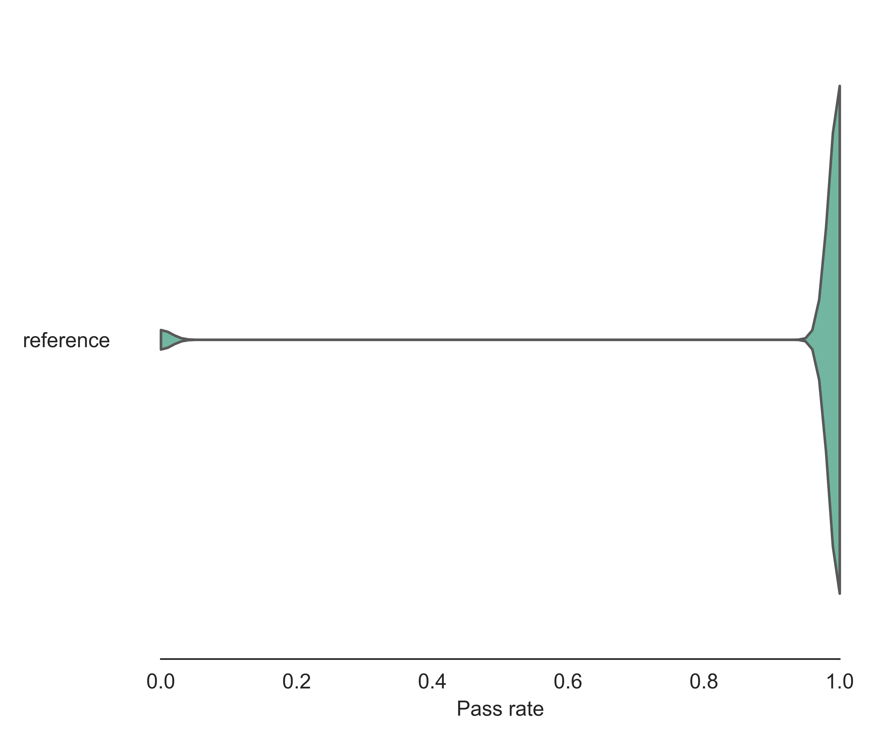
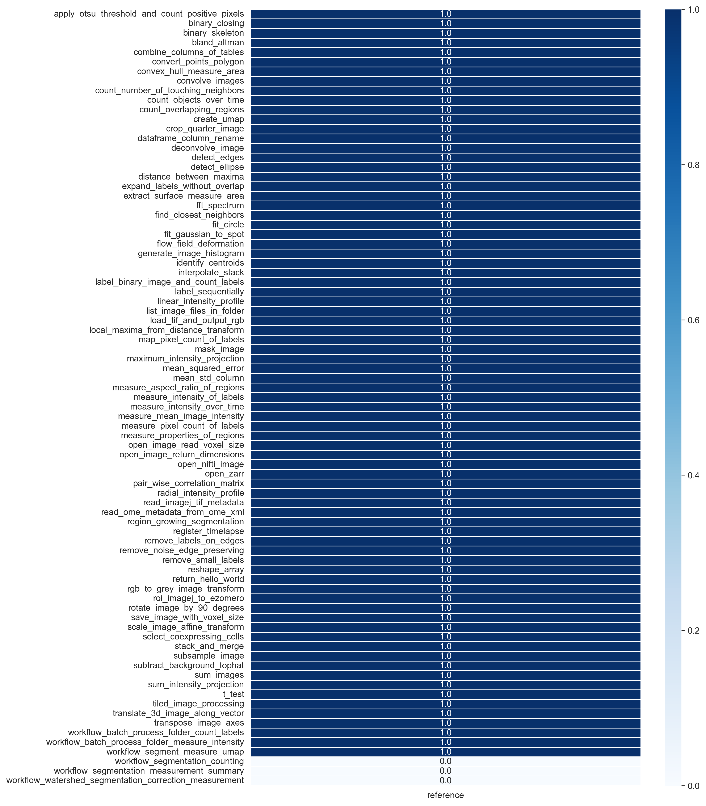

# Benchmarking Large Language Models for Bio-Image Analysis Code Generation

This is a fork of the [HumanEval](https://github.com/openai/human-eval) repository where modifications were made 
to adapt the evaluation harness for the Bio-image Analysis domain. 
The original HumanEval repository is an evaluation harness for the HumanEval problem solving dataset described in the paper 
"[Evaluating Large Language Models Trained on Code](https://arxiv.org/abs/2107.03374)". 

## Insights

Using the benchmark in this repository, we compared 15 LLMs in their capabilities to generate Bio-image Analysis Python code. 
Therefore, we defined test-cases [listed here](test_cases/readme.md) which can be used to evaluate functional correctness of bio-image analysis code.
The pass-rate shown in this plot expresses the probability that generated code passed given unit-tests:



Furthermore, we visualize the observed pass-rate per task:



To find out more, please read our [preprint](https://www.biorxiv.org/content/10.1101/2024.04.19.590278v2)

Feedback is welcome, e.g. as [Github issue](https://github.com/haesleinhuepf/human-eval-bia/issues).

## Installation

Make sure to use python 3.10 or later:
```
$ mamba create --name heb python=3.10
$ conda activate heb
```

Check out and install this repository:
```
$ git clone https://github.com/haesleinhuepf/human-eval-bia.git
$ cd human-eval-bia
$ pip install -e .
$ pip install -r requirements.txt
```

To run the benchmark for OpenAI-based models, please create an OpenAI API Key as [explained in this blog post](https://help.openai.com/en/articles/5112595-best-practices-for-api-key-safety).

To run the benchmark for Google gemini models, you need to create a Google Cloud account [here](https://console.cloud.google.com/welcome/) and
a project within the Google cloud (for billing) [here](https://console.cloud.google.com/projectcreate). 
You need to store authentication details locally as explained [here](https://cloud.google.com/docs/authentication/provide-credentials-adc#local-dev). 
This requires installing [Google Cloud CLI](https://cloud.google.com/sdk/docs/install). In very short: run the installer and when asked, activate the "Run gcloud init' checkbox. Or run 'gcloud init' from the terminal yourself. Restart the terminal window.
After installing Google Cloud CLI, start a terminal and authenticate using: 
```
gcloud auth application-default login
```
Follow the instructions in the browser. Enter your Project ID (not the name). 

To run the benchmark for the models accessible via  [Helmholtz' blablador service](https://helmholtz-blablador.fz-juelich.de/), which is free for German academics, just get an API key as explained on
[this page](https://sdlaml.pages.jsc.fz-juelich.de/ai/guides/blablador_api_access/) and store it int your environment as `BLABLADOR_API_KEY` variable.

To run the benchmark for locally running models, install [Ollama](https://ollama.com). We used ollama 0.1.29 for Windows (preview).

## Usage

**This program exists to run untrusted model-generated code. Users are strongly
encouraged not to do so outside of a robust security sandbox. The [execution
call](https://github.com/haesleinhuepf/human-eval-bia/blob/master/human_eval/execution.py#L37-L47)
in `execution.py` is deliberately commented out to ensure users read this
disclaimer before running code in a potentially unsafe manner. See the comment in
`execution.py` for more information and instructions.**

![CAUTION]
> Also note when executing the benchmark using commercial models such as chatGPT or gemini, substantial costs can be caused.

To reproduce our benchmarks, you can go through the notebooks provided in the `/notebooks` directory:
* [Create benchmarking set from notebooks](demo/create_cases.ipynb): Convert notebook files into HumanEval-compatible JSONL files.
* [Generate code samples from LLMs](demo/create_samples.ipynb): Send prompts to LLMs multiple times and store results in sample_....JSONL files.
* [Evaluate samples by executing code](demo/evaluate_samples.ipynb): Run the code samples and store the results in _result....JSONL files.
* [Detect missing requirements](demo/detect_missing_requirements.ipynb): In case this notebook lists missing requirements, that can be installed, the benchmark maintainers may add those requirements and run the evaluation step again.
* [Summarize pass rates pass@k](demo/summarize_by_passk.ipynb): Draw box-plot with pass-rates for all LLMs.
* [Summarize pass rates grouped by test-cases](demo/summarize_by_case.ipynb): Visualize for each test-case the pass-rate of all LLMs individually.
* [Summarize error messages](demo/summarize_error_messages.ipynb): Count common error messages in evaluation responses.
* [Summarize used Python libraries](demo/summarize_used_libraries.ipynb): Count common Python Libraries in evaluation responses.

## Extending the benchmark

You can add new test cases by adding new notebooks to the `/notebooks/human-eval-bia` directory. 
Check out the examples there and make sure to stick to the following rules.

![CAUTION]
> Most importantly: When writing new test case notebooks, do not use language models for code generation. 
> You would otherwise bias the benchmark towards this model. 
> Use human-writen code only and/or examples from the documentation of specific librarires.

The notebooks have to have the following format:
* Within one cell there must be a function that solves a specific [bio-image analysis] task. Very basic example, computing the sum of two numbers:
```python
def sum(a, b):
    """
    This function computes the sum of two numbers.
    """
    return a + b
```
* This function must have a meaningful docstring between """ and """. It must be so meaningful that a language model could possibly write the entire function.
* There must be another code cell that starts with `def check(candiate):` and contains test code to test the generated code.
* The text code must use `assert` statements and call the `candidate` function. E.g. if a given function to test is `sum`, then a valid test for `sum` would be:
```
def check(candidate):
    assert candidate(3, 4) == 7
```
* A third python code cell in the notebook must call the `check` function with your custom function, e.g. like this, to prove that the code you provided works with the tests you wrote:
```
check(sum)
```
* Save the new test-case in a notebook that has the same name as the test, so that people can find it easily. In our case above: `sum.ipynb`.
* Optional: You can add as many markdown cells as you like to explain the test case.

## Adding dependencies

We aim at collecting all Python libraries that LLMs are capable of using in the bio-image analysis context in the [requirements.txt](requirements.txt) file. Additionally, for documentation purposes, we want to document in which environment the last evaluation was executed. Thus, also an environment.yml file needs to be updated, in particular when requirements change. If the new test-case requires specific Python libraries to be installed, please add them to the [requirements.txt](requirements.txt). 
Also update the [environment.yml](environment.yml) file using this command:

```
conda env export > environment.yml 
```

Submit both files together with your pull-request. That way we can see how the environment changes when merging a pull-request.

## How it works

This is how it works under the hood:
* From the cell with the function definition all code above the docstring, including the docstring, will be stored as prompt. Many prompts from many notebooks will be collected in one `jsonl` file.
* Given language models will be asked to complete the code by adding python code below which does what the docstring claims.
* Afterwards, the generated code examples will be executed and the tests will be run to see if the results were correct.

## Our modifications compared to HumanEval

You can compare the original HumanEval code with ours to see modifications [here](https://github.com/haesleinhuepf/human-eval-bia/compare/original_human_eval). The modifications include adding our test cases and jsonl files. Furthermore, on techincal level, we did these modifications to the HumanEval evaluation framework:

* [Fix can't pickle bug
](https://github.com/haesleinhuepf/human-eval-bia/commit/628fd26d2fd72b040d976819b4e1c7073fa26907). Here we took code provided as [pull-request to the original HumanEval](https://github.com/openai/human-eval/pull/30) repository, which was not merged by the maintaines but seemed reasonable.
 
* [Fix windows-related signal issue](https://github.com/haesleinhuepf/human-eval-bia/commit/8d03cfe7f34505063f3604ffe8db86235d33e437). This modification was necessary to make the evaluation run on Windows. See also the discussion in this [github issue](https://github.com/openai/human-eval/issues/18#issuecomment-1609063376).

* [We disabled reliability_guard](https://github.com/haesleinhuepf/human-eval-bia/commit/56df3b04cbb36441367596d1aad16255d797e09b) because it broke all tests. Different compared to HumanEval, our test-cases involve complex python libraries which do system calls in order to process data. Disabling these calls made our tests fail.

* [We added some code to copy example data to the temporary folder](https://github.com/haesleinhuepf/human-eval-bia/pull/16). This enables us to run tests where the file system is used, e.g. to solve tasks such as "list all image files in a folder". Original HumanEval was not capable of evaluating such questions.

## Citation

To cote our work, e.g. if you are using the Bio-image Analysis test-case set, please cite the following:

```
@article {benchmark_llm_bia,
	author = {Robert Haase and Christian Tischer and Jean-Karim H{\'e}rich{\'e} and Nico Scherf},
	title = {Benchmarking Large Language Models for Bio-Image Analysis Code Generation},
	elocation-id = {2024.04.19.590278},
	year = {2024},
	doi = {10.1101/2024.04.19.590278},
	publisher = {Cold Spring Harbor Laboratory},
	URL = {https://www.biorxiv.org/content/early/2024/04/25/2024.04.19.590278},
	eprint = {https://www.biorxiv.org/content/early/2024/04/25/2024.04.19.590278.full.pdf},
	journal = {bioRxiv}
}
```


In case you are only using the evaluation code in this repository, consider using and citing [HumanEval](https://github.com/openai/human-eval?tab=readme-ov-file#citation) instead.
